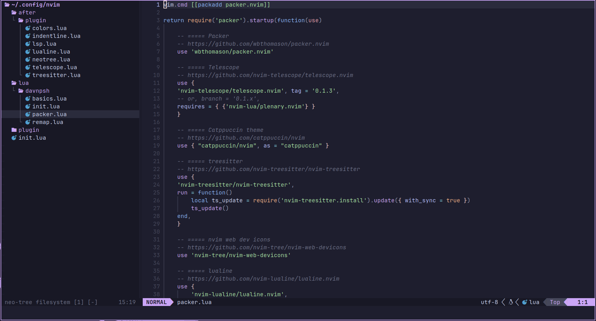

<div align="center">

# davnpsh's Neovim config.

<br>



</div>

<br>

This repository contains my personal configuration files for Neovim based on [ThePrimeagen's configuration](https://github.com/ThePrimeagen/init.lua).

## Dependencies

For clipboard and some plugins to work:

* `Neovim` >= 0.9
* `nodejs` >= 14.14 (must include `npm`)
* `xclip`
* `ripgrep`

In Arch Linux:

```bash
doas pacman -S neovim xclip ripgrep npm
```

## Installation

Make a folder the `nvim` folder under `$HOME/.config/`. Then, clone this repository locally and paste `lua/` and `after/` folders there.

```bash
mkdir "$HOME/.config/nvim" \
tempdir=$(mktemp -d) \
git clone https://github.com/davnpsh/nvim-config.git "$tempdir" \
cp -r "$tempdir/lua" "$tempdir/after" "$HOME/.config/nvim" \
rm -r "$tempdir"
```

For Linux, install `packer.nvim`:

```bash
git clone --depth 1 https://github.com/wbthomason/packer.nvim\
 ~/.local/share/nvim/site/pack/packer/start/packer.nvim
```

## First usage

Open Neovim, ignore errors and execute `:PackerSync`. Finally, close and reopen Neovim.

## Plugins

These are the plugins I currently use (this list may be outdated, check `lua/davnpsh/packer.lua` for an updated version):

### [`packer.nvim`](https://github.com/wbthomason/packer.nvim)
Current plugin manager.

### [`telescope.nvim`](https://github.com/nvim-telescope/telescope.nvim)
For grepping strings and recent files.

### [`catppuccin`](https://github.com/catppuccin/nvim)
Catppuccin theme.

### [`nvim-treesitter`](https://github.com/nvim-treesitter/nvim-treesitter)
Better highlightning.

### [`nvim-web-devicons`](https://github.com/nvim-tree/nvim-web-devicons)
It can be treated as a dependency, but it is better to install it and let it have its own folder.

### [`lualine.nvim`](https://github.com/nvim-lualine/lualine.nvim)
Statusline.

### [`indent-blankline.nvim`](https://github.com/lukas-reineke/indent-blankline.nvim)
Just a simple indent line when tabbing.

### [`coc.nvim`](https://github.com/neoclide/coc.nvim)
For LSP and extensions.

I use these:

* [`coc-pairs`](https://github.com/neoclide/coc-pairs) for autopairs.
* Language servers like `tssserver`.

### [`markdown-preview.nvim`](https://github.com/iamcco/markdown-preview.nvim)
For editing markdown.

### [`neo-tree.nvim`](https://github.com/nvim-neo-tree/neo-tree.nvim)
Having a tree of folders and files is nice.

# 

<div align="center">

 [](https://archlinux.org/) [](https://neovim.io/)

</div>

